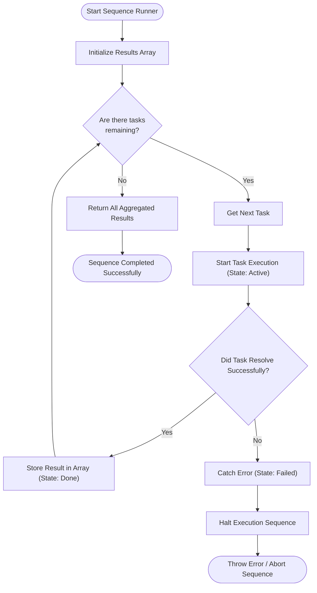

# PROMISE-BASED-SEQUENCE-RUNNER

A modern, interactive Promise-based sequence runner built with JavaScript, HTML, and CSS. 

This project explores strict sequential execution of asynchronous tasks using JavaScript's native Promises and `async/await`. It guarantees that each task in an array waits for the previous one to fully resolve before it starts, preserving order and aggregating results.

## How It Works (Flowchart)

Below is a flowchart detailing the logic of the strict sequential runner algorithm:

## Features
- **Strict Ordering:** Ensures asynchronous operations execute one after the other.
- **Error Handling:** If any task fails, the entire sequence stops, preventing subsequent tasks from running in an invalid state.
- **Live UI Feedback:** Real-time visual updates showing tasks as `Pending`, `Running...`, `Completed`, or `Failed`.
- **Built-in Terminal UI:** Logs execution status, timestamps, and aggregated results directly in the browser.

## Getting Started
Simply open `index.html` in your favorite web browser to view and interact with the Live Promise Runner!